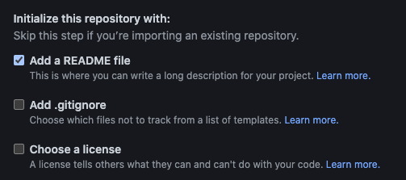
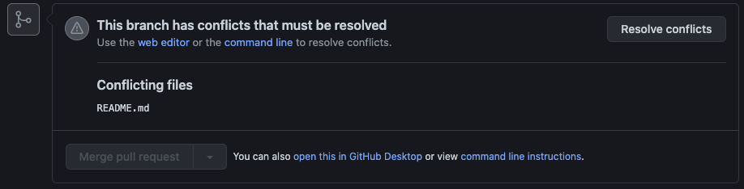
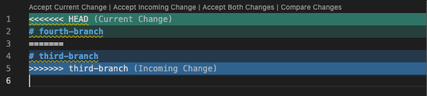

# Creating and Resolving Merge Conflicts Practice

In this practice you will be creating merge conflicts and then resolving them in both GitHub on your browser, and via the command line.

## Setting up

Start by creating your own GitHub repository and initialize it with a `README.md` by selecting the following option:

Feel free to name the repository to your liking, but otherwise, no other selections need to be made. Go ahead and hit `Create repository`.

Now you have a repository with just a `README.md` that contains the title of your repository. Open your Terminal and clone this repository into your local environment to get started.

## The first branch

First, make sure you're inside the correct directory for the repo and make a new branch:

> git checkout -b first-branch

This will create and check you out to a new branch called `first-branch`. Now, open up the `README.md` file and change the text within the header tag:

Save the changes and push these changes to the repository (`git add .`, `git commit -m "my first commit"`, `git push origin first-branch`).

Then make a PR (pull request) on GitHub to merge these changes into main. You can do this by:

- Opening the repository on GitHub
- Going to `Pull requests` > `New pull request`
- Set base as `main` and compare as `first-branch`
- `Create pull request`

Do not merge this branch yet as you will be creating the merge conflict on this branch.

## The second branch

Now, checkout back to the main branch and WITHOUT PULLING, create a new branch:

> git checkout -b second-branch

Now you're checked out to a new branch called second-branch. Change the header again, but this time the text in the header show:

    # second-branch

Repeat the process of pushing the changes and making a PR. This time, after creating the PR, hit `Merge pull request` to merge the branch into `main`.

## The merge conflict arises

After merging in `second-branch` into `main`, go back to Pull requests and open up your first PR from `first-branch`. You'll see now that the `Merge pull request` button is disabled and the following message is displayed:

Now it's time to fix the conflict!

## Resolving via GitHub in the browser

Usually the conflict shouldn't be large unless you have many people working on the same files on separate branches. In this case, the differences are very minor and easy to resolve. In the message mentioned above, hit the `Resolve conflicts` button.

You will be brought to a page that displays the files with conflicts on the left along with the lines of code in question.

The conflicting lines will be denoted with the markers: `<<<<<<<,` `=======,` and `>>>>>>>.` The lines between `<<<<<<<` and `=======` show the incoming changes from the branch you're trying to merge in, in this case `first-branch`. The lines between `=======` and `>>>>>>>` show the existing changes in `main` already.

You can choose to keep either line or both. In this case, keep what's in `first-branch`. Delete all the markers and the line `# second-branch` and the `Mark as resolved` button on the top right will be enabled. Click it and then click the `Commit merge` button that appears after.

You should be brought back the the PR for `first-branch` and now the `Merge pull request` button should be enabled. Go ahead and click it to merge in the branch!

Since you chose to keep `# first-branch`, now main should show only that.

## Resolving via the command line

If you prefer to use the command line to resolve them, that's an option as well. Replicate the events above to create another merge conflict with new branches (e.g. `third-branch` and `fourth-branch`).

After merging in `fourth-branch` to master in GitHub, go back to your Terminal and checkout to `main`. Note: `third-branch` should have a PR open but should NOT be merged in yet.

Right now, `main` is still in its original state so perform a pull:

    git pull origin main

You should have the changes from merging in `fourth-branch` now. Next, you will merge in `third-branch` into master manually to trigger the merge conflict. To do this, run:

    git merge origin third-branch

Immediately, you should see the following error:

    Auto-merging README.md
    CONFLICT (content): Merge conflict in README.md
    Automatic merge failed; fix conflicts and then commit the result.

Open up `README.md` and you should see the following:

VSCode conveniently comes with tooling to help you visualize which changes come from where! Simply select whichever option you want: `Accept Current Change`,`Accept Incoming Change`, or `Accept Both Changes` and VSCode will clean it up for you so that you can commit the correct changes.

Select Accept Incoming Change and you should see the markers disappear and only the line # third-branch remain. Save the changes, and then add/commit the changes to complete the merge. When that's done, don't forget to push the changes so that they're updated on the repository!

That's it! You've successfully created your first merge conflicts and resolved them
